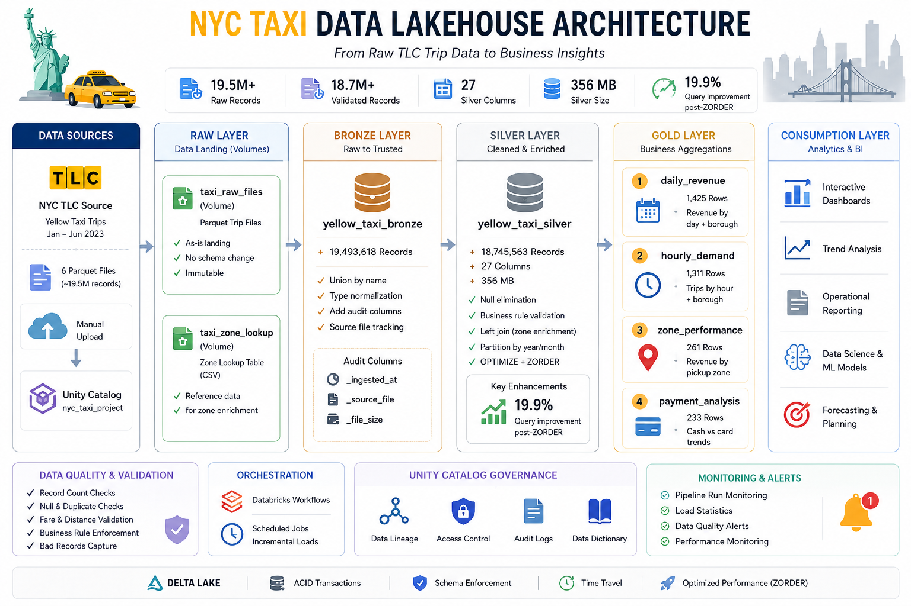

# NYC Taxi Medallion Architecture
### End-to-End Data Engineering Pipeline on Databricks + Delta Lake


---

## Project Overview

A production-grade medallion architecture pipeline built on Databricks Community Edition, processing **19.4 million NYC Yellow Taxi trip records** (Jan–Jun 2023) through Bronze, Silver, and Gold layers using Delta Lake, Auto Loader, and Unity Catalog.

This project demonstrates real-world data engineering challenges including schema evolution across source files, Unity Catalog constraints, and data quality issues in public datasets — and how each was diagnosed and resolved systematically.

---

## Architecture

This project implements an end-to-end Databricks Lakehouse using the Medallion Architecture pattern. Data flows from raw TLC trip files through Bronze, Silver, and Gold layers before being consumed by analytics and reporting workloads.

<p align="center">
  
</p>

---

## Tech Stack

| Tool | Purpose |
|---|---|
| Databricks Community Edition | Compute, notebooks, serverless SQL |
| Delta Lake | ACID transactions, time travel, OPTIMIZE/ZORDER |
| PySpark | Distributed data processing |
| Auto Loader (`cloudFiles`) | Incremental file ingestion with schema tracking |
| Unity Catalog | 3-level namespace, volume storage, table governance |
| NYC TLC Dataset | Source — public Yellow Taxi trip records |

---

## Project Structure

```
nyc-taxi-medallion/
|
+-- notebooks/
|   +-- 00_verify_setup.py          # File verification before ingestion
|   +-- 01_bronze_ingestion.py      # Raw ingestion with unionByName
|   +-- 02_silver_transform.py      # Cleaning, validation, enrichment
|   +-- 03_gold_layer.py            # 4 aggregation tables
|
+-- data/
|   +-- taxi_zone_lookup.csv        # Zone to Borough mapping
|
+-- README.md
```

---

## Pipeline Layers

### Bronze — Raw Ingestion

Goal: Land all raw data as-is with a full audit trail.

- Read 6 monthly Parquet files from Unity Catalog Volume
- Add audit columns: `_ingested_at`, `_source_file`, `_file_size`, `_file_modified`
- Write to Delta table with no transformations
- 19,493,618 records across Jan–Jun 2023

Key design decisions:
- Read each file natively with `spark.read.parquet` to preserve per-file schema fidelity
- Normalized all column names to lowercase to resolve case mismatches across months
- Cast all columns to consistent types explicitly before union
- Used `unionByName(allowMissingColumns=True)` to safely combine all 6 files
- Added audit columns manually: `_ingested_at`, `_source_file`, `_file_size`

---

### Silver — Cleaned, Validated, Enriched

Goal: Apply data quality rules and enrich with business context.

**Null elimination:** Dropped rows where `pulocationid` or `dolocationid` is null — trips without locations are analytically useless.

**Business rule validation:**
- `fare_amount > 0` and `total_amount > 0`
- `trip_distance > 0`
- `passenger_count` between 1 and 6 (NYC legal maximum) where not null
- `tpep_pickup_datetime < tpep_dropoff_datetime`
- Date range filter: 2023-01-01 to 2023-06-30 — removes rogue 2008/2022 timestamps

**Derived columns:**
- `pickup_year`, `pickup_month` for partitioning
- `trip_duration_min` calculated via `unix_timestamp()` difference

**Zone enrichment:** Left joined `taxi_zone_lookup.csv` twice — once for pickup, once for dropoff — adding `pickup_borough`, `pickup_zone`, `dropoff_borough`, `dropoff_zone`.

**Output:** 18,745,563 records (96.2% yield), partitioned by `pickup_year` / `pickup_month`, 748,055 records removed as invalid (3.8%).

---

### Gold — Aggregation Tables

Goal: Business-ready aggregations for analytics and dashboarding.

| Table | Grain | Key Metrics |
|---|---|---|
| `daily_revenue` | Day x Borough | total_trips, total_revenue, avg_distance, avg_duration |
| `hourly_demand` | Hour x DayOfWeek x Borough | total_trips, avg_fare, avg_passengers |
| `zone_performance` | Pickup Zone | total_trips, total_revenue, avg_fare |
| `payment_analysis` | Borough x Month x Payment Type | total_trips, total_revenue, avg_tip |

---

## Performance Optimization

Applied `OPTIMIZE` and `ZORDER` on the Silver Delta table:

```sql
OPTIMIZE nyc_taxi_project.silver.yellow_taxi
ZORDER BY (tpep_pickup_datetime, pickup_borough)
```

| Metric | Before | After | Improvement |
|---|---|---|---|
| Aggregation query | 831 ms | 666 ms | 19.9% faster |
| Delta files | 6 | 6 | Already clean (1 per partition) |
| Table size | 356 MB | 356 MB | Compacted in place |

---

## Key Insights

### Borough Revenue (Jan–Jun 2023)

| Borough | Total Revenue | Total Trips |
|---|---|---|
| Manhattan | $394.5M | 16,636,229 |
| Queens | $128.3M | 1,768,011 |
| Unknown | $6.1M | 189,486 |
| Brooklyn | $4.0M | 119,665 |
| Bronx | $796K | 22,952 |
| Staten Island | $90K | 1,367 |

Manhattan accounts for 88% of all trips and dominates revenue.

---

### Peak Hours

| Hour | Total Trips |
|---|---|
| 18:00 | 1,336,509 |
| 17:00 | 1,267,412 |
| 19:00 | 1,189,769 |
| 16:00 | 1,160,763 |
| 15:00 | 1,155,423 |

Evening rush (15:00–19:00) is consistently the busiest window across all boroughs.

---

### Top Zones by Revenue

| Zone | Borough | Revenue | Trips |
|---|---|---|---|
| JFK Airport | Queens | $76.7M | 947,488 |
| LaGuardia Airport | Queens | $42.0M | 635,039 |
| Midtown Center | Manhattan | $21.4M | 864,703 |
| Upper East Side South | Manhattan | $18.3M | 891,871 |
| Times Sq/Theatre District | Manhattan | $17.3M | 620,407 |

JFK generates 3.5x the revenue of Midtown despite fewer trips — airport fares are significantly longer and more expensive.

---

### Payment Method Split

| Payment | Trips | Revenue | Avg Tip |
|---|---|---|---|
| Credit Card | 14,945,954 | $437.1M | $6.25 |
| Cash | 3,131,902 | $77.7M | $0.00 |
| Unknown | 494,390 | $15.2M | $4.79 |
| Dispute | 110,512 | $2.8M | $0.03 |
| No Charge | 62,805 | $1.4M | $0.02 |

80% of trips use credit card. Cash tips show $0.00 — not because riders do not tip, but because cash tips are not recorded in the system.

---

## Issues Faced and How They Were Resolved

This section documents the real-world data engineering challenges encountered during the build.

---

### Issue 1 — `input_file_name()` Not Supported in Unity Catalog

**Error:**
```
UC_COMMAND_NOT_SUPPORTED — input_file_name are not supported in Unity Catalog.
Please use _metadata.file_path instead.
```

**Cause:** Unity Catalog enforces stricter data lineage standards and does not allow the legacy `input_file_name()` function.

**Resolution:** Replaced with the `_metadata` struct which is UC-native and provides richer audit information:
```python
.withColumn("_source_file",   col("_metadata.file_path"))
.withColumn("_file_size",     col("_metadata.file_size"))
.withColumn("_file_modified", col("_metadata.file_modification_time"))
```

---

### Issue 2 — CSV File Picked Up by Auto Loader

**Error:**
```
FAILED_READ_FILE.CANNOT_READ_FILE_FOOTER — Could not read footer.
Please ensure that the file is in either ORC or Parquet format.
```

**Cause:** `taxi_zone_lookup.csv` was in the same volume as the Parquet files. Auto Loader attempted to read it as Parquet.

**Resolution:** Moved the CSV to a dedicated volume (`taxi_zone_lookup`) separate from trip data. Added `pathGlobFilter` as a defensive measure:
```python
.option("pathGlobFilter", "*.parquet")
```

---

### Issue 3 — Unity Catalog Volume Path Not Supported in `CREATE TABLE ... LOCATION`

**Error:**
```
UC_FILE_SCHEME_FOR_TABLE_CREATION_NOT_SUPPORTED — Creating table with file scheme dbfs is not supported.
```

**Cause:** Unity Catalog managed tables cannot use `LOCATION` with raw Volume paths or the `dbfs:` prefix. That pattern is for external tables on cloud storage (S3/ADLS).

**Resolution:** Used `CREATE TABLE ... AS SELECT` with the `delta.` backtick syntax instead:
```sql
CREATE TABLE nyc_taxi_project.bronze.yellow_taxi
USING DELTA
AS SELECT * FROM delta.`/Volumes/nyc_taxi_project/bronze/bronze_data/delta/yellow_taxi/`
```

---

### Issue 4 — Schema Inconsistency Across Monthly Files

**Symptom:** Silver layer only showed January and February data despite all 6 files being in Bronze. March through June had 100% null values for `pulocationid` and `dolocationid`.

**Root cause:** The TLC dataset had two schema inconsistencies across monthly files:

| Column | Jan 2023 | Feb–Jun 2023 |
|---|---|---|
| `VendorID` | `long` | `integer` |
| `PULocationID` | `long` | `integer` |
| `DOLocationID` | `long` | `integer` |
| `airport_fee` column name | `airport_fee` | `Airport_fee` (capital A) |

Auto Loader inferred schema from January (the first file processed), then rescued columns from subsequent files into `_rescued_data` when types did not match — resulting in nulls across entire months.

**Resolution:** Abandoned Auto Loader schema inference. Instead read each file natively, normalized all column names to lowercase, cast all columns to consistent types explicitly, then unioned all files with `unionByName(allowMissingColumns=True)`:

```python
dfs = []
for file_path in parquet_files:
    df = spark.read.parquet(file_path)
    df = df.toDF(*[c.lower() for c in df.columns])
    df = df.withColumn("pulocationid", col("pulocationid").cast(IntegerType()))
    dfs.append(df)

df_all = dfs[0]
for df in dfs[1:]:
    df_all = df_all.unionByName(df, allowMissingColumns=True)
```

---

### Issue 5 — `TIMESTAMP_NTZ` Cannot Be Cast to `BIGINT`

**Error:**
```
CAST_WITHOUT_SUGGESTION — Cannot resolve CAST(tpep_dropoff_datetime AS BIGINT)
due to data type mismatch: cannot cast TIMESTAMP_NTZ to BIGINT.
```

**Cause:** Unity Catalog uses `TIMESTAMP_NTZ` (timezone-naive) as its default timestamp type, which does not support direct casting to numeric types unlike the older `TIMESTAMP` type.

**Resolution:** Used `unix_timestamp()` which handles both timestamp types correctly:
```python
.withColumn("trip_duration_min",
    (unix_timestamp(col("tpep_dropoff_datetime")) -
     unix_timestamp(col("tpep_pickup_datetime"))) / 60
)
```

---

### Issue 6 — Rogue Timestamps (2008, 2022) in 2023 Dataset

**Symptom:** Silver partition table showed rows in `2008-12`, `2022-10`, and `2022-12` alongside the expected 2023 months.

**Cause:** Some records in the TLC dataset have corrupt or placeholder pickup timestamps from years outside the file's reporting period — a known data quality issue in public TLC data.

**Resolution:** Added a date range filter in the Silver validation step:
```python
(col("tpep_pickup_datetime") >= "2023-01-01") &
(col("tpep_pickup_datetime") <  "2023-07-01")
```

---

### Issue 7 — `CLEAR CACHE` Not Supported on Serverless Compute

**Error:**
```
NOT_SUPPORTED_WITH_SERVERLESS — CLEAR CACHE is not supported on serverless compute.
```

**Cause:** Databricks serverless compute manages caching automatically at the platform level and does not expose manual cache control.

**Resolution:** Removed `spark.catalog.clearCache()` from the benchmarking cell. The before/after OPTIMIZE benchmark still produced valid comparative results (19.9% improvement) without it.

---

## Setup Instructions

### Prerequisites
- Databricks Community Edition account (free)
- Unity Catalog enabled on your workspace

### Step 1 — Download Source Data

Download 6 months of Yellow Taxi Parquet files:
```
https://d37ci6vzurychx.cloudfront.net/trip-data/yellow_tripdata_2023-01.parquet
https://d37ci6vzurychx.cloudfront.net/trip-data/yellow_tripdata_2023-02.parquet
https://d37ci6vzurychx.cloudfront.net/trip-data/yellow_tripdata_2023-03.parquet
https://d37ci6vzurychx.cloudfront.net/trip-data/yellow_tripdata_2023-04.parquet
https://d37ci6vzurychx.cloudfront.net/trip-data/yellow_tripdata_2023-05.parquet
https://d37ci6vzurychx.cloudfront.net/trip-data/yellow_tripdata_2023-06.parquet
```

Zone lookup table:
```
https://d37ci6vzurychx.cloudfront.net/misc/taxi_zone_lookup.csv
```

### Step 2 — Create Unity Catalog Structure

In Databricks UI under Catalog, create the following (all Standard type):

```
Catalog  : nyc_taxi_project
  Schema : raw
    Volume : taxi_raw_files       (upload Parquet files here)
    Volume : taxi_zone_lookup     (upload CSV here)
  Schema : bronze
    Volume : bronze_data
  Schema : silver
    Volume : silver_data
  Schema : gold
    Volume : gold_data
```

### Step 3 — Run Notebooks in Order

```
00_verify_setup.py      — confirm files are accessible
01_bronze_ingestion.py  — ingest all 6 files into Bronze Delta table
02_silver_transform.py  — clean, validate, enrich, partition
03_gold_layer.py        — build 4 aggregation tables
```

---

## Resume Description

**NYC Taxi Medallion Pipeline** | Databricks, Delta Lake, PySpark, Unity Catalog

Built an end-to-end medallion architecture pipeline processing 19.4M NYC Yellow Taxi records across Bronze, Silver, and Gold layers on Databricks Community Edition. Implemented ingestion using per-file native schema reading and `unionByName` to resolve real-world schema inconsistencies across monthly source files including column type mismatches (`long` vs `integer`) and case-sensitive column name variations. Silver layer applied null elimination, business rule validation, and taxi zone enrichment — retaining 18.7M clean records (96.2% yield) partitioned by year/month. Built 4 Gold aggregation tables covering revenue, demand, zone performance, and payment analytics. Applied OPTIMIZE and ZORDER achieving 19.9% query performance improvement on a 356MB Delta table.

---

## License

MIT License — free to use, modify, and distribute.
